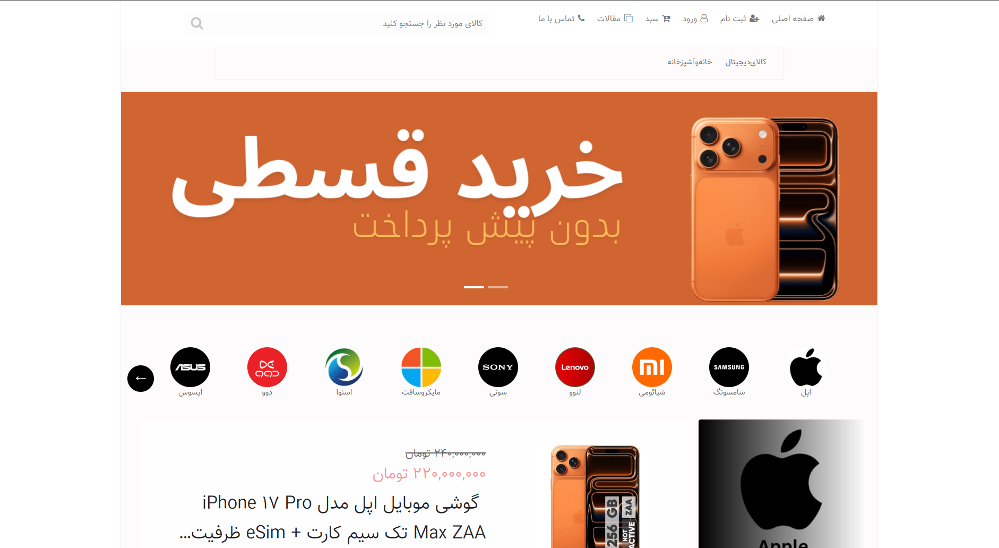
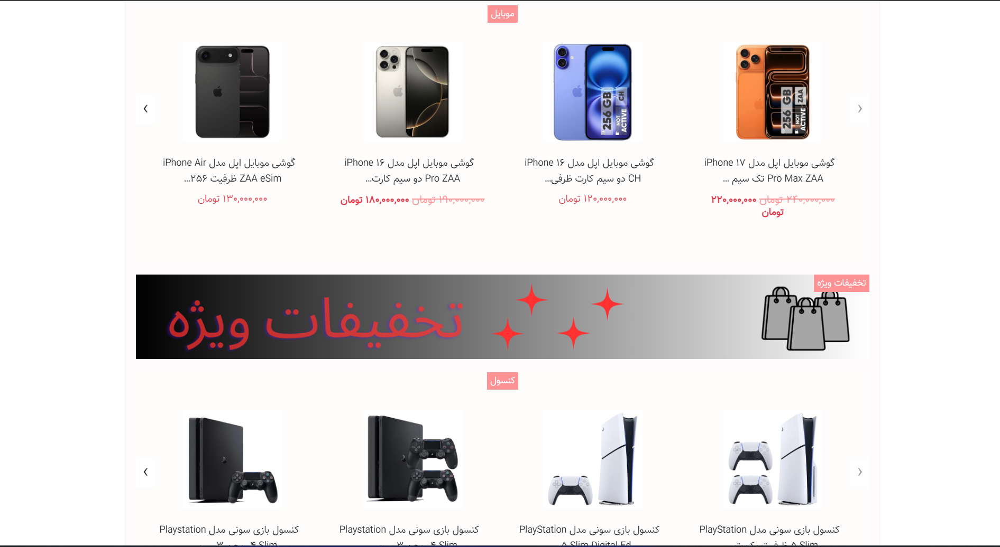
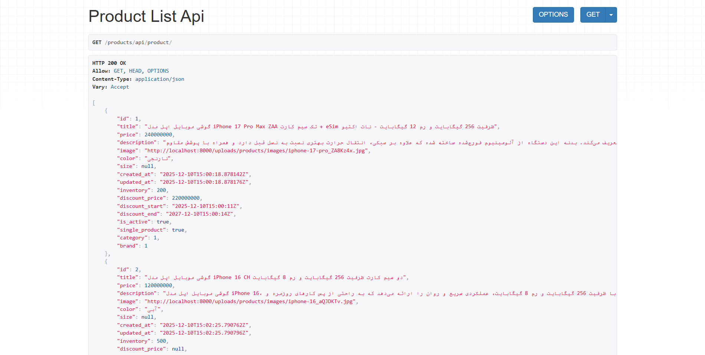
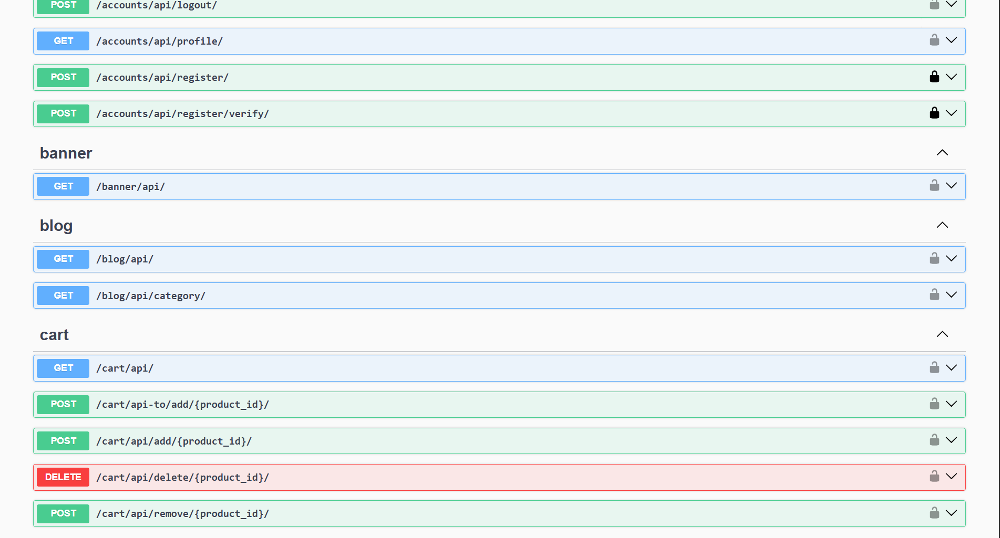

# Django Shop

The project is fully dockerized and can be run using Docker Compose.
The Django web application is accessible via the browser and is implemented in Persian (Farsi).
The Django Rest Framework (DRF) API endpoints are intended to be accessed and tested using Postman only.






---
## Technologies
- Python 3.12
- Django
- Django Rest Framework
- PostgreSQL
- Redis
- Docker & Docker Compose
- Celery

---
## Features
- User authentication and management using Django (registration, login, password reset)
- The user activation code is sent to the Celery container logs
- Complete product management system
- Article/blog section
- Search functionality
- Shopping cart system
- Contact Us section
- Core app for homepage and common site features
- RESTful API implemented with Django Rest Framework (DRF)

---
## Running the Project

##### open docker Desktop

##### open CMD
```bash
cd Desktop
```

```bash
git clone https://github.com/Amirk22/django-shop
```

```bash
cd django-shop
```

```bash
docker-compose up -d --build
```
